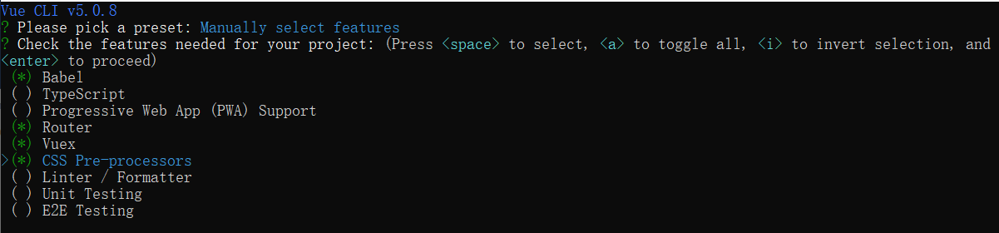
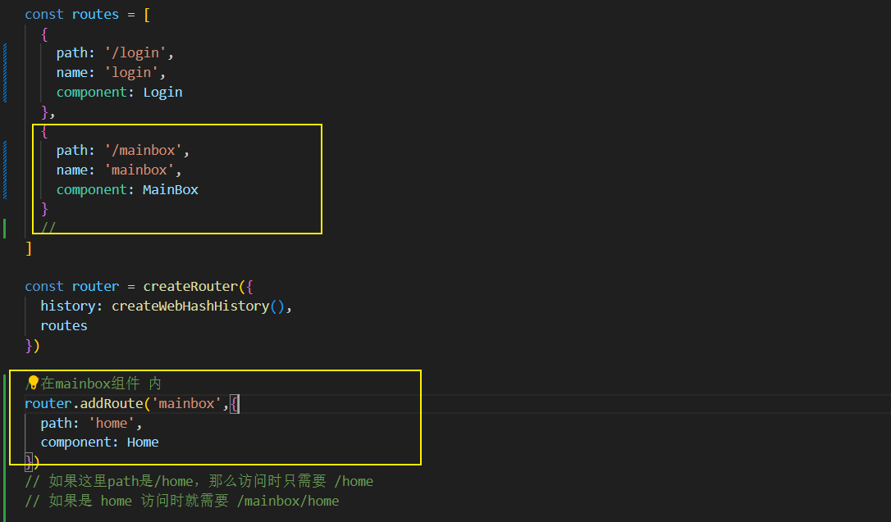
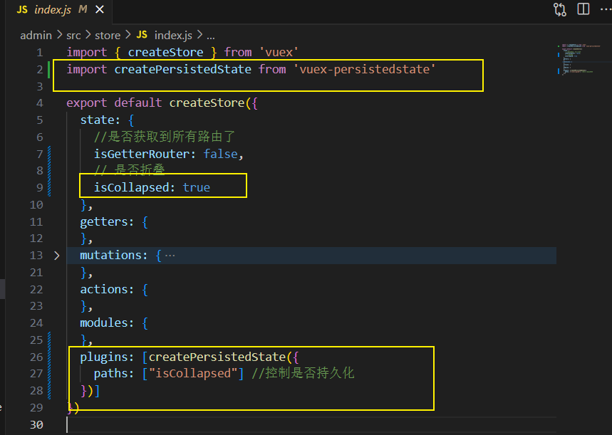
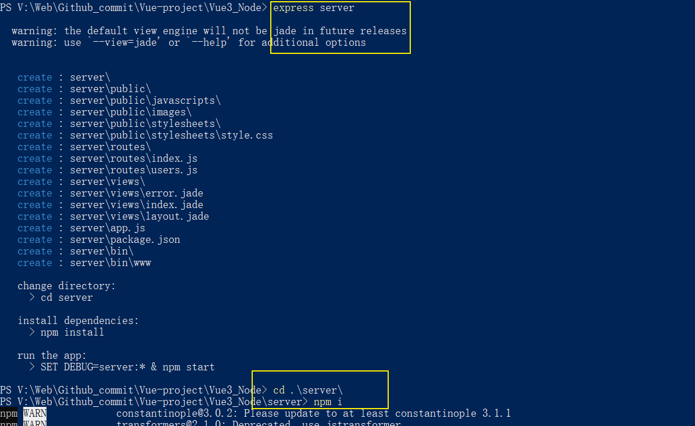
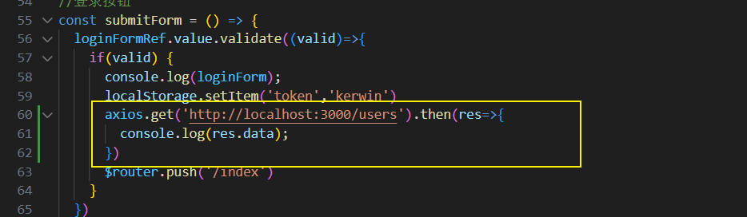
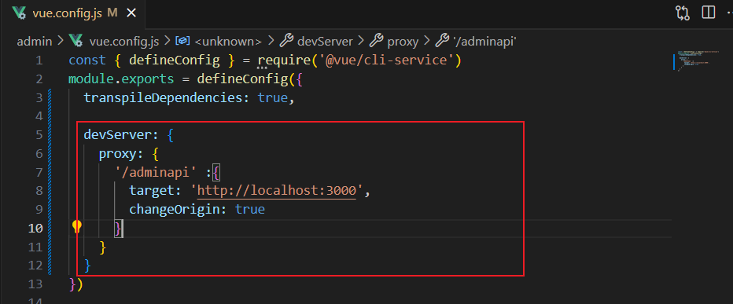
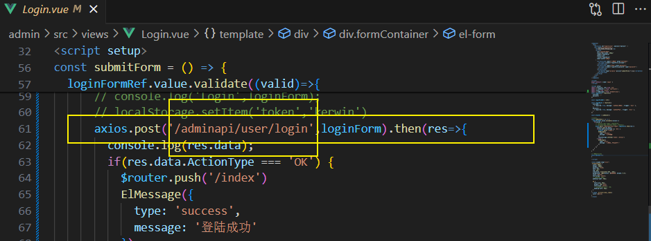
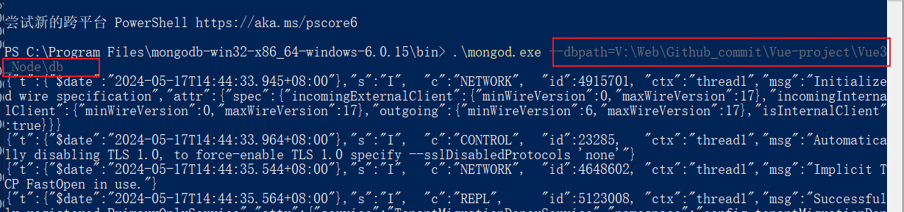
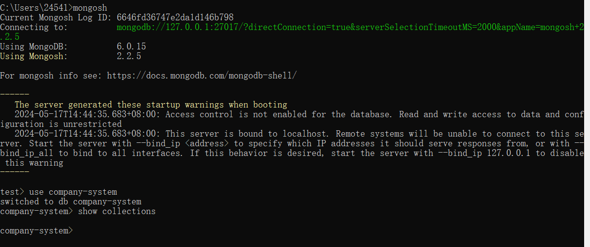

admin：后台系统的vue代码


babel+router+无TS+vuex+CSS预处理器+sass+pnpm(和老师不同)

> vue create admin

手动配置




# 路由

动态添加路由利用

- router.addRoute



- 数组 foreach

  

如果没有登陆成功那么不可以访问一些路由

- 路由拦截器

> 路由守卫https://blog.csdn.net/qq_36958916/article/details/122496369

# 登录页面

粒子效果

@tsparticles/vue3

# 折叠菜单 SideMenu

> 重点
>
> vuex使用
>
> vuex持久化：借助插件vuex-persistedstate
>
> el-menu的 一级二级菜单、折叠collapse、折叠持久化(vuex-persistedstate)、折叠动画collapse-transition、路由跳转router、高亮default-active
>
> useRoute()的fullPath

vuex的使用 P6

vuex持久化：插件vuex-persistedstate



# TopHeader

dropdown：解决el-dropdown点击有白框

flex布局

# server-login(node)

用node编写后端代码（服务器部分）。

借助express框架搭建服务器，然后通过前端的vue.config.js解决跨域问题。

## express

`express`官方提供的一套脚手架`express-generator`来完成初始项目的创建

1、全局下载 npm install express-generator -g

2、powershell

3、



## 解决跨域问题

以前端登录为例，本来是要从localhost3000获取数据，但是因为跨域（前端是8080,后端是3000，8080是vue开启的，3000是express开启的），所以需要解决跨域问题。



<font color="red">**如下图，这里用vue中的反向代理进行解决。**</font>

意思是以后请求 /adminapi时，是往自己这请求



 

## 项目文件目录

### 补充express

（app和router）

- app对象通常表示Express应用程序。通过调用Express模块导出的顶级express()函数来创建它

```javascript
const express = require('express');
const app = express();
app.get('/'，(req，res)=> {
   res.send（'hello world'）;
});
app.listen(3000);
```

- router代表一个由express.Router()创建的对象，在路由对象中可定义多个路由规则

```javascript
const express = require('express');
const router = express.Router();
router.get('/',(req,res)=>{
	res.send('1111');
});

router.post('/index',(req,res)=>{
	res.send('index');
});

module.exports = router;
```

app与router联系 (app.js)

```javascript
const express = require('express');
//引入router
const router = require('./router.js');
const app = express();
//加载路由，路由处理
app.use(router);
app.listen(3000,()=>{
	console.log('running.....')
});
```

### api文件

api分两类

adminapi 给后台系统用

webapi 给企业官网用

- routes文件夹

新建admin和web文件夹，admin中存放后台系统用的路由，web中存放企业官网用的路由

**在app.js中注册**

routes文件下 配置子路由

- 新建controllers

拿到前端数据，处理加工后，调用数据层（services），返回数据给前端。

- 新建services

实现业务逻辑：引用创建的数据库模型，进行数据的增删改查

- 新建models

数据库模型

### 补充mongoose 

对mongodb进行限制

> pnpm i mongoose --save

mongodb模块化：models文件夹利用mongoose创建集合、限制字段

### 补充body-parser

获取请求体数据需要借助包：> npm i body-parser

**express帮我们配置好了**

### 补充mongo

设置数据库存储位置，利用ROBO创建数据

### 流程

/routes/admin/UserRouter.js 和用户有关的api配置  =>

/controllers/admin/UserController.js  ① 拆解前端数据 req.body给service层 ②拿到数据返回 => 

/services/admin/UserService 处理数据（比如登录的数据到了这里，去数据库中查找是否有这个用户）

/config/db.config.js 通过mongoose连接mongo服务器、创建数据库、在 /bin/www中引入数据库

在路由中判断是哪一个请求（post get delete）。进入到对应的controller层；再进入service层中对比数据库中的数据进行判断。

## 测试(前后端连接)

【第一步】启动mongo数据库

找到mongo安装目录的bin，然后用powershell打开  ① 设置数据库存储位置②启动数据库



【第二步】启动服务器（启动server文件夹中的express）并运行（连接数据库）

（验证）打开一个CMD窗口，用 mongosh命令连接到mongo数据库，查看是否创建数据库成功



【第三步】启动浏览器（启动admin文件夹中的vue3）

打开网页看数据返回是否正确

## login-token

### axios拦截器、路由拦截

第一次：浏览器向服务器发出登录请求，服务器验证了用户名密码正确之后，返回的数据中携带token

在token时效内：① 浏览器向服务器不管发送什么请求都需要携带token，因此 /admin(浏览器)中使用axios拦截器。②对于服务器，每一个接口都需要验证token，因此 /server（服务器）中使用路由拦截，统一token验证，刷新token

**前端：用axios拦截器实现。**、

**后端：用express的全局中间件 app.use()实现。注意app.use()的生效时机是，前端代码发送【请求】。**

### JWT

```npm i jsonwebtoken```

- server服务器

server/utils/JWT.js 中 使用 jsonwebtoken

server/controller/admin/UserController 中调用 JWT

- admin浏览器

admin/utils 中配置axios拦截器

### 实现

- admin-axios拦截器

> /admin/src/util/axios.config.js

请求拦截器：每次请求时都要带上token

响应拦截器：每次得到响应结果都要再存储一边新token。（**因为token是会更新的：只要换一个页面，也就是重新发一遍请求，服务器就可以确认你还在线，就重刷一次token；如果过了时效，就需要跳回登陆页面**）

- server-app.use，express中间件

**这里一定要注意app.use生效的时机，是检测到浏览器有请求。**

> /server/util/JWT.js

调用jsonwebtoken，自己封装一个JWT的sign、verify接口

注意 JWT中规定如果要设置token有效时间，可以携带单位，比如10s表示十秒，1d表示一天。

>/server/controller/admin/UserController.js

第一次登录，调用/server/util/JWT.js ，生成一个token，并把token设置在响应报文的header里面，返回给浏览器。

> /server/app.js

全局中间件，每当浏览器对服务器有请求的时候，都会调用这个 app.use()。

- 这里有两种情况

①访问登陆页面，直接放行next

②访问其他页面，此时浏览器的请求头中是携带了token的，我们就需要调用 /server/util/JWT.js 看token是否过期。如果过期就返回401，401的意思是需要身份验证。


