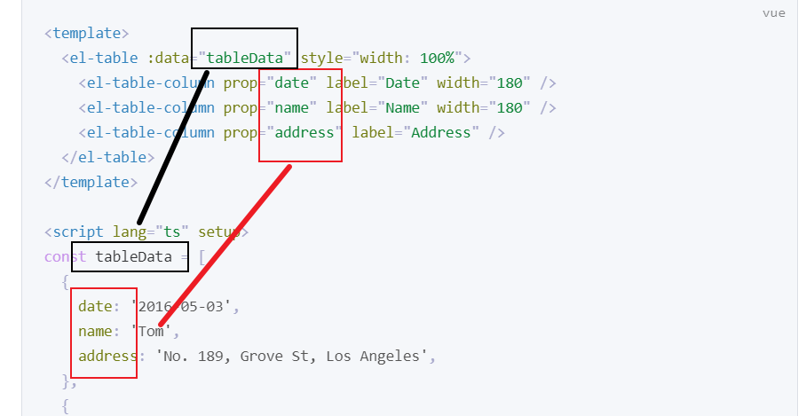

重点难点总结

elementplus : el-form  菜单栏 el-table

数据库

node

# elementplus

## el-table

table数据的对应关系

tableData：一定是一个 数组，每一个子元素都是一个对象

label：页面上显示的标签

prop：对应的数据，这里不需要写tableData.date，直接写date就可以了



**table中的插槽（具名插槽）**

存放自定义数据（对原本的数据进行加工后呈现）

```html
<el-table :data="tableData">  
    <el-table-column>
      <template #default="scope">
      </template>
    </el-table-column>
</el-table>
```

scope.row可以拿到这一整行的数据，也就是 tableData数组中的某一个子元素（对象）

## 其他常用

### el-avatar

展示用户头像时使用

### el-tag

el-table中的tag

### el-popconfirm

确认删除的泡泡框

### el-dialog

编辑时

### el-swicth


# vue3

父子组件通信——自定义事件：upload模块（文件上传模块）

onMounted：获取数据列表（用户列表产品列表），一跳转路由就要显示，这个逻辑用生命周期函数中的onMounted

插槽：el-table中使用到

## reactive的深拷贝浅拷贝

NewsEdit.vue: onMounted

## route.params.id

## 组件生命周期

NewsEdit.vue中，使用了 Edit.vue组件

SideBar.vue 加载路由时

# axios

- async await

可以用 try catch，这样网络500时就不会崩溃

- post get

get：获取数据列表

- get

/:id 通配符 UserRouter.delete('/adminapi/user/list/:id',UserController.delList)

req.params.id

# 重要的代码逻辑

文件上传（前后端都重要）multer：涉及文件上传, 普通post不行, 需要加上 multer中间件

后端的分层：model controller service 

前端权限管理：路由

# CSS

 height: calc(100vh - 60px);  减号两侧一定要有空格

element组件的css，深度 :: v-deep

# 数据库mongo

# 组件

## 富文本

wangeditor

内容时html格式，如果要显示到网页上，需要使用v-html

，粒子库，moment

multer：涉及文件上传, 普通post不行, 需要加上 multer中间件
